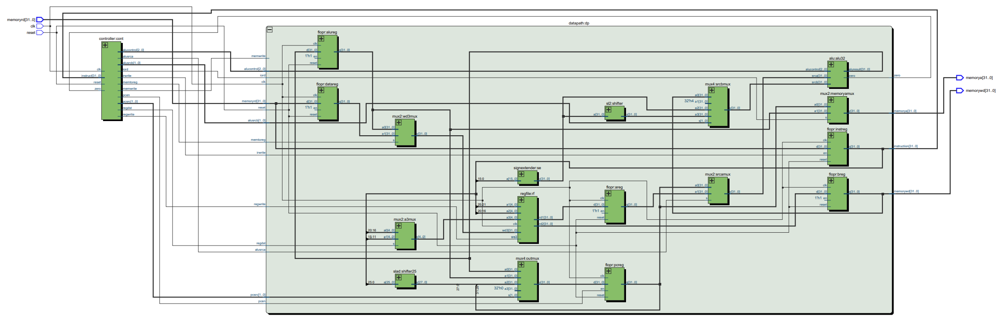
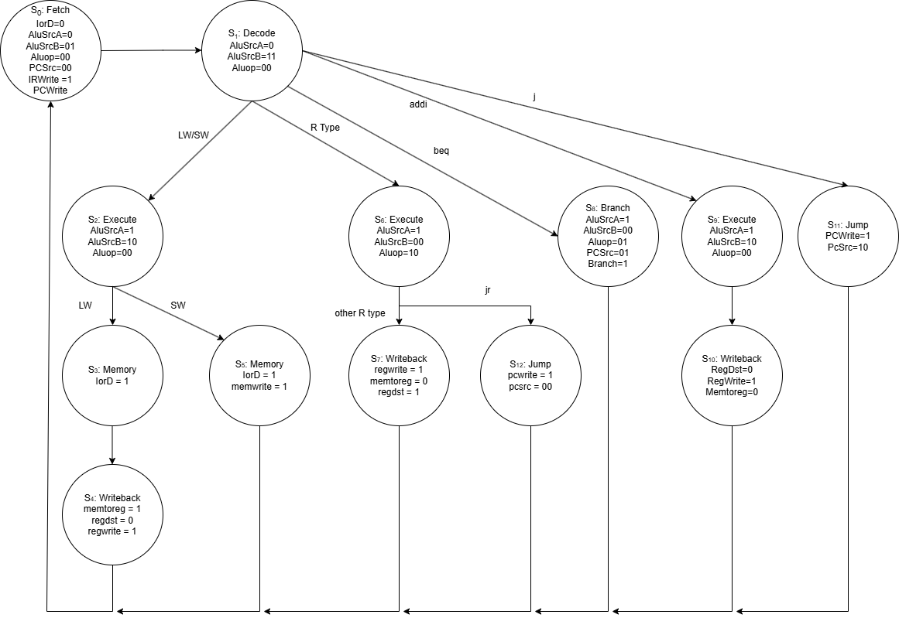

# Multicycle MIPS Processor (VHDL)

## Overview
This project implements a 32-bit multicycle MIPS processor in VHDL.  
The design was simulated using ModelSim and synthesized using Intel Quartus Prime.

The processor follows the classic multicycle architecture separating:
- Datapath
- Controller (FSM-based control unit)

---

##  Architecture

The top-level module instantiates:
- Controller
- Datapath

The datapath includes:
- ALU
- Register File
- Program Counter (PC)
- Multiplexers
- Sign Extender
- Shift Left units

### RTL Netlist (Quartus RTL Viewer)

---

### Control FSM Diagram

The controller is implemented as a finite state machine that sequences instruction execution across multiple cycles.

---

## Supported Instructions

Currently implemented instructions:

- `lw`
- `sw`
- `R type instructions including jr`
- `beq`
- `addi`
- `j`

---
